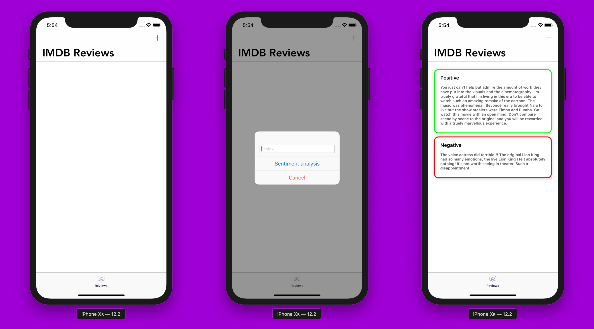
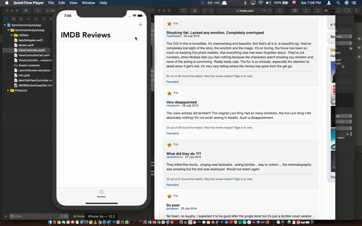

# Using Core ML and Natural Language for Sentiment Analysis on iOS
>Classifying IMBD reviews on-device in Swift

Imagine that you have just launched a new advertising campaign, or a new product, just like Disney’s new movie “The Lion King”, and you want to have a clear view of what people think of the movie. Natural language processing (NLP) can help with that, and specifically the task of sentiment analysis (SA).

In simple terms, this is a technique that allows you to quickly determine if people are responding positively or negatively to a given topic—in this use case movies.

## Full Tutorial

I've wrote a full medium tutorial:

**[Medium Article](https://heartbeat.fritz.ai/using-core-ml-and-natural-language-for-sentiment-analysis-on-ios-d9469ce6c0ef)**

## Final Result:

**Here’s the final result with the face detection and recognition.**

## About me

**Omar MHAIMDAT** 

* [Linkedin](https://www.linkedin.com/in/omarmhaimdat/)
* **Email:** omarmhaimdat@gmail.com
* [Look at the rest of my repos](https://github.com/omarmhaimdat/)

Distributed under the MIT license. See ``LICENSE`` for more information.

